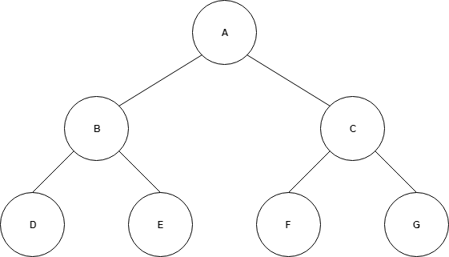
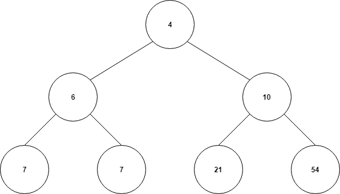
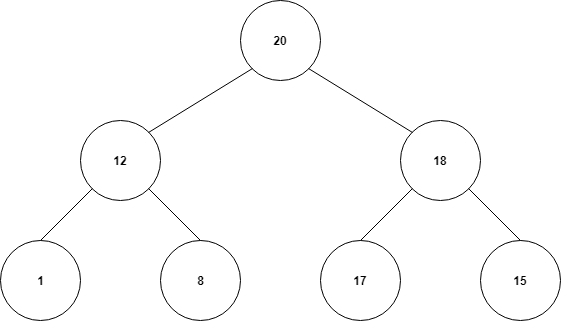
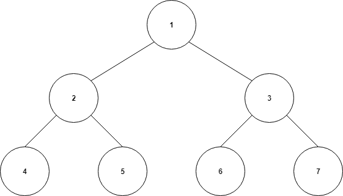
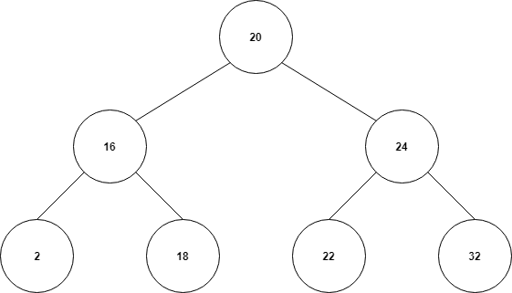

# Heaps and Binary Search Trees

## Contents
 * Solution.cs - challenge solution
 * ITree.cs - a Tree interface
 * EmptyBST.cs - an EmtptyBST class
 * NonEmptyBST.cs - a NonEmptyBST class

ITree, EmptyBST, NonEmptyBST implements a BST design.

## Heaps

A heap is data structure made up of a parent and children



In the above; 
 - Node A is a parent of both B and C
 - Node A is also the **root** node of the heap
 - Think recursively; A/B/C is a heap, as is B/D/E and C/F/G

We work with 2 types of heaps, **Min-Heap** and **Max-Heap**

## Min-Heap

This is where the smallest element is the root and all children must be less than their parents.



Note; the relationship is between the child and it's parent only.
There are no conditions to be kept between a child and it's sibling.

## Max-Heap

This is where the largest element is the root and all children are less than their parents.



Likewise, siblings needn't hold any relationship.

## Data Structure

Here the values in the node's represent an index.



We can find a nodes children using a simple algorithm on the parents node;

```
parentIndex * 2 = leftChildIndex
(parentIndex * 2) + 1 = rightChildIndex
```

Like wise we can evaluate a childs parent node using the algorithm;

```
childIndex / 2 = parentNode
```
Note using integer division.

We can implement a heap in a traditional array

```
[20, 12, 18, 1, 8, 17, 15]
```

To find the child nodes of the root node (index 0)

```
(0 + 1) * 2 = 2
((0 + 1) * 2) + 1 = 3
```
Note the addition of index + 1

## Binary Search Trees

An extension of the heap, a BST meets some additional criteria
 - Left child node is less than the parent node
 - Right child node is greater than the parent node



Used for *Path Finding Algorithms*, breadth-first and depth-first search.
