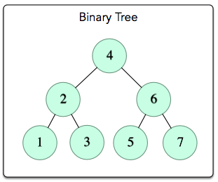

# Day23 BST Level Order Traversal

A level-order traversal is aptly named as it traverses a BST level by level.

Given the following BST;  


A level-order traversal will visit 4, 2, 6, 1, 3, 5, 7.

Progamatically this can be acheived with a recursive algorithm

```
levelOrder(BinaryTree t) {
    if(t is not empty) {
        // enqueue current root
        queue.enqueue(t)
        
        // while there are nodes to process
        while( queue is not empty ) {
            // dequeue next node
            BinaryTree tree = queue.dequeue();
            
            process tree's root;
            
            // enqueue child elements from next level in order
            if( tree has non-empty left subtree ) {
                queue.enqueue( left subtree of t )
            }
            if( tree has non-empty right subtree ) {
                queue.enqueue( right subtree of t )
            }
        }
    } 
}
```

The use of a Queue data structure is paramount here, lets walk through it;

```
enqueues 4                // [4]
dequeues 4                // []
enqueues 2 and 6          // [2, 6]
dequeues 2                // [6]
enqueues 1 and 3          // [6, 1, 3]
dequeues 6                // [1, 3]
enqueues 5 and 7          // [1, 3, 5, 7]
dequeues 1                // [3, 5, 7]
dequeues 3                // [5, 7]
dequeues 5                // [7]
dequeues 7                // []
```